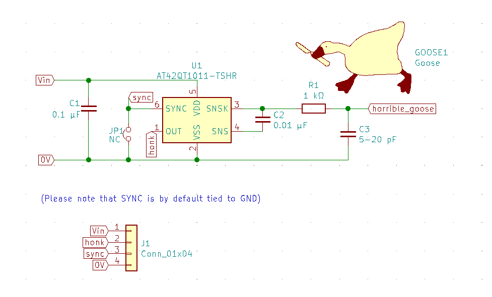
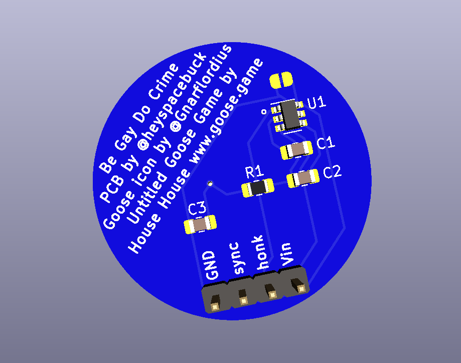

# Horrible Goose Badge

[@Gnarflordius](https://twitter.com/Gnarflordius) made a KiCad footprint of the Horrible Goose so I turned it into a capacitative-touch circuit that can be hooked up to the microcontroller of your choice.

A few notes on the circuit itself:
1. This uses the [UDFN-8 AT42QT1011](https://www.microchip.com/wwwproducts/en/AT42QT1011) because the SOT-23-6 package is out of stock everywhere. ¯\\\_(ツ)_/¯
2. The SYNC pin is default tied to GND. You have to cut the jumper bridge if you want to use a different SYNC option.
3. The HONK pin goes high when it detects a touch.

A few notes on the KiCad project:
1. gnarf's original footprint is located in the base directory as `honk.kicad_mod`, it was built with KiCad Nightly and isn't compatible with 5.1.10, the latest stable version.
2. Inside the folder `goose.pretty` are three footprints that _are_ compatible with KiCad 5.1.10, because that's the one I use: `honk_compat` which is a faithful recreation of the original; `honk_captouch` which adds a copper pour under the goose body, for cap-touch purposes; and `honk_captouch_scaled`, which makes the footprint bigger.
3. Inside `goose.lib` is a schematic symbol for the goose also!