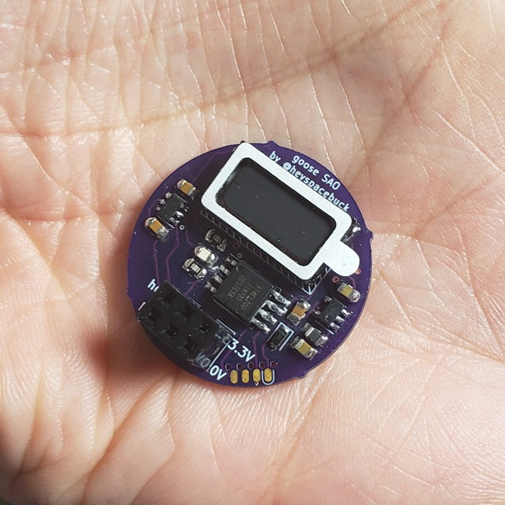

# Horrible Goose Badge SAO

[@Gnarflordius](https://twitter.com/Gnarflordius) made a KiCad footprint of the Horrible Goose so I turned it into a set of capacitive-touch boards that function as [Shitty Add-Ons](https://hackaday.com/2019/03/20/introducing-the-shitty-add-on-v1-69bis-standard/). All the boards are based on the [Atmel AT42QT101x chips](http://ww1.microchip.com/downloads/en/DeviceDoc/40001947A.pdf), which are out of stock everywhere right now. Sorry. If anyone has suggestions for alternate cap-touch sensors, or knows how to set up QTouch on an ATtiny, please drop me a line.

The `/kicad` folder is set up to contain multiple projects that each rely on `goose.lib` and `\goose.pretty` for schematic symbols and PCB footprints. These projects are:

### SAO 1: Horrible Goose Cap Touch Sensor

Here we see the basic SAO. You can find it in the `/kicad` folder under the name `SAO-captouch-sensor-only.pro`. The SCL and SDA lines are not needed; the HONK pin (GPIO1, by SAO naming conventions) connects to the sensor output; the SYNC pin (GPIO2) is by default tied to ground. When the goose is touched, the HONK pin is driven HIGH; otherwise, it is pulled LOW by an internal pull-down resistor. If for whatever reason you want to mess with the default SYNC settings, you can cut the jumper that ties it to ground and instead drive it via GPIO2.

You can see this circuit (with a non-SAO pinout) connected to an Arduino in [this tweet from back in May](https://twitter.com/heyspacebuck/status/1396235318634840066). The Arduino code being used is available in the `/code/arduino_honk` folder.

### SAO 2: Horrible Goose Cap Touch Sensor - After Dark

This project is in the `kicad/` folder named `SAO-captouch-sensor-only-after-dark.pro`. It's the same circuit as above, but the "HONK" text and sensor footprint have been optimized for OSH Park's After Dark boards. 

### SAO 3: Horrible Goose, But Extra Evil

This project is in the `kicad/` folder named `SAO-captouch-and-eye-after-dark.pro`. Another After Dark board. Similar to the others, but instead of breaking out the SYNC pin, GPIO2 is used to drive a reverse-mounted LED. This makes the goose eye glow and lays bare the true nature of this horrible fowl menacing the village. [You can see it in action (kinda) here](https://twitter.com/heyspacebuck/status/1437613800312610819). KiCad thinks none of the traces are valid because I used graphic arcs instead of normal routing.

### SAO 4: Self-Contained Honking Goose Unit

This project is in the `kicad/` folder named `SAO-speaker-and-controller.pro`. Once I learned about the existence of extra-small "sugar cube" speakers, I knew I'd have to build an SAO that could function as a standalone honking device. In addition to the cap-touch IC, there's an ATtiny85 driving a 16mm×9mm speaker. Once I got the tiny speaker, it became clear that 3.3V is not sufficient to get an audible honk! I have added a simple boost converter to drive the ATtiny85 and the speaker with 5V instead of 3.3V; be warned that I've only tested it on a breadboard, not this PCB.

The ATtiny85 is programmed with a [SOICbite connector](https://hackaday.io/project/165917-soicbite-programmingdebug-connector-footprint); if you don't have one it is easy to solder wires to the SOICbite pads. The code is in the `code/tiny85_speaker_control` folder. It's set up for compiling/programming using the Arduino IDE and ATtinyCore approach. You could also use Atmel's QT creator, since the code uses no Arduino-specific methods; just rename `tiny85_speaker_control.ino` to `main.c`.

## Licenses and acknowledgments 

The horrible goose comes from [Untitled Goose Game by House House](https://goose.game/). It's a charming game and you should check it out! The original KiCad goose footprint was designed by [@Gnarflordius](https://twitter.com/Gnarflordius) and released under a [WTFPL license](http://www.wtfpl.net/). I made some minor changes to the footprint and also created a pair of matching schematic symbols. The SAO PCBs and various bits of code are released under the [CERN Open Hardware Licence 1.2](https://en.wikipedia.org/wiki/CERN_Open_Hardware_Licence), but to be honest I'm not sure I'm using it correctly. Do what you want.

The Arduino and ATtiny85 code is derived from two sources: ["Audio Sample Player v2" by David Johnson-Davies](http://www.technoblogy.com/show?QBB) (used under CC-BY-4.0 license), and ["speaker_pcm" by Michael Smith <michael@hurts.ca>](https://playground.arduino.cc/Code/PCMAudio/) (unclear license).

The [SOICbite connector](https://hackaday.io/project/165917-soicbite-programmingdebug-connector-footprint) is an awesome little design from Simon Merrett and is released under the BSD 2-Clause "Simplified" License.

The HONK text was generated using the very cool [KiBuzzard plugin by Greg Davill](https://github.com/gregdavill/KiBuzzard).

